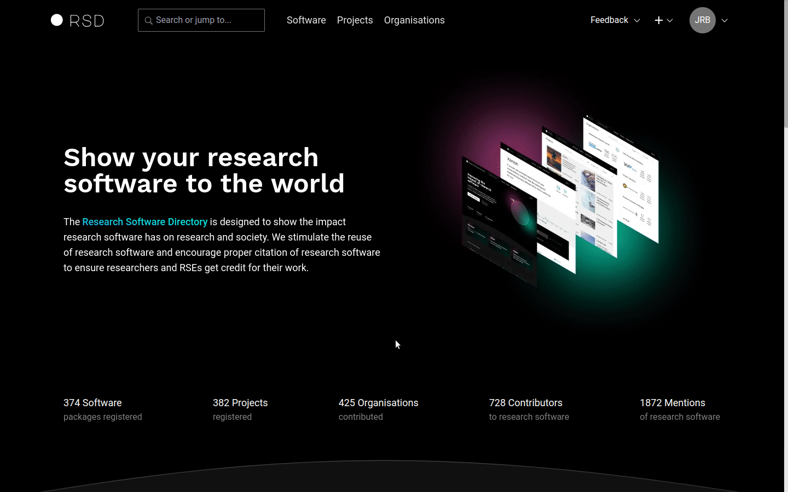
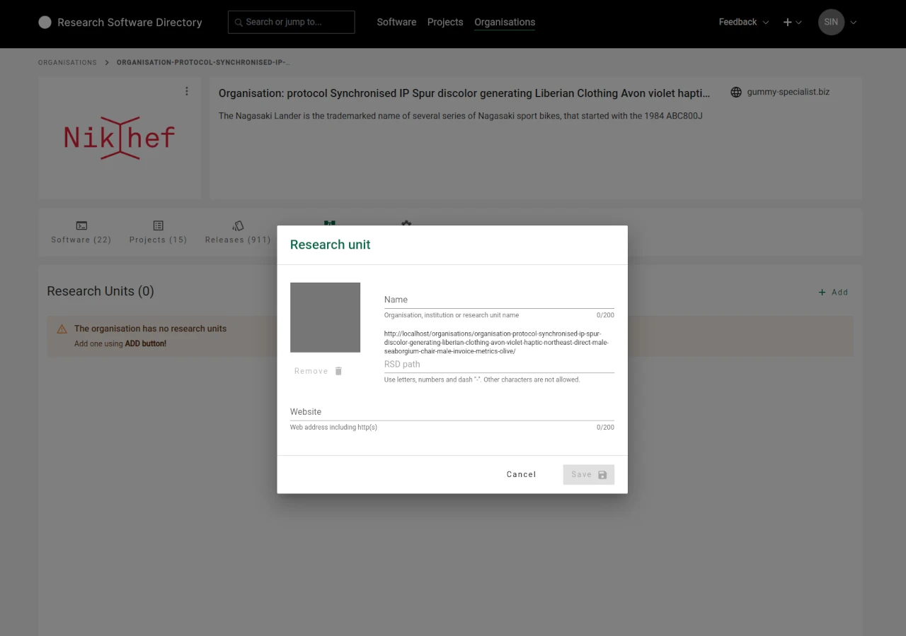

# Maintaining an organisation

Organisations have the opportunity to maintain their representation within the RSD.
In order to achieve this, official representatives of the organisation can take on the role of maintainers of their organisation.

## How to claim an organisation?

If you would like to claim an organisation, please have a look at [Register or claim an organisation](/users/register-organisation/).

## What can organisation maintainers do?

The RSD distinguishes between __primary__ and __invited maintainers__.
Here is an overview of what each of them can do:

|                                        | Primary maintainer | Invited maintainer |
|----------------------------------------|:------------------:|:------------------:|
| Edit About section                     |         x          |         x          |
| Upload/delete logo                     |         x          |         x          |
| Edit organisation metadata             |         x          |         x          |
| Reject affiliations (software/project) |         x          |         x          |
| Pin/unpin software/projects            |         x          |         x          |
| Invite maintainers                     |         x          |         x          |
| Remove maintainers (not primary)       |         x          |         x          |
| Add new research units                 |         x          |                    |
| Remove/change primary maintainer *     |                    |                    |
| Change organisation URL path *         |                    |                    |

(*) These actions can only be perfomred by administators. If necessary, contact us via [rsd@esciencecenter.nl](mailto:rsd@esciencecenter.nl).

## My organisations

To see a list of organisations you are a maintainer of use __My organisations__ option in your __profile menu__.

## Edit logo

You can edit the logo of your organisation

You can upload a new logo or remove it.
The RSD supports common image formats, e.g. jpg, png or svg.

:::tip
If possible, please upload an __SVG__ version of your organisation's logo for optimal visual presentation within the RSD.
:::

## General settings

Under __"Settings - General settings"__ you can edit:

- Name: displayed in the organisation card and in the header of the organisation page
- Short description: displayed in the organisation card and in the header of the organisation page
- Website: displayed in the header of the organisation page
- ROR id: displayed in the header of the organisation page. It enables RSD to extract additional information from ROR about the organisation

## Manage maintainers

As a maintainer, you can invite or remove other maintainers from your organisation.

:::warning
The __primary maintainer__ of an organisation is defined by rsd administrators. If you want to change the primary maintainer, contact us via [rsd@esciencecenter.nl](mailto:rsd@esciencecenter.nl).
:::

To invite new maintainers, click on __"Generate invite link"__. A link will be generated. You can either copy this link or click on "Email this invite" to open your mail program with a preformulated email.

## About page

In the __"About"__ section, relevant information about your organisation can be added in a free text form.
To edit the content of the section, please navigate to __"Settings"__ and scroll down to the __"About"__ section.
The text can be formatted using [Markdown syntax](https://www.markdownguide.org/basic-syntax/).

:::tip
If there is no content for the About page, the page will not be shown.
:::

## Pin software or project

To pin specific software or project to the start of the respective list, click on the three dots in the upper right corner of a software or project card and click on __Pin software__ / __Pin project__. It will then be shown at the beginning of the list. If you no longer want to pin a software or project, click on the dots in the software card and click __Unpin software__ / __Unpin project__.

:::tip
The "Pinned" order is the default order applied when visiting organisation page.
:::

## Deny affiliations

An organisation maintainer can deny affiliations with software or project. To do this, open the context menu of the respective software or project, and click on __Block affiliation__.

:::tip
When the affiliation with an entry has been denied

- the organisation will not appear on the entry's page (software or project page)
- the entry will not appear in the organisation lists (for the public viewers)
- the entry will not be included in the metrics of the organisation
- the organisation will be shown with "Blocked" icon on the edit page of the item (software or project)
- the denied affiliation is visible to the organisation and the software/project maintainers
:::

## Add research units

The RSD is capable of representing the organisational structure of an organisation.
The structure is represented using __Research units__. A research unit has the same properties as an organisation and is maintained in the same manner, except for the fact that it has a parent organisation and is not listed on the organisations overview grid.

It is possible to create several levels of nested research units.

:::warning
Research units can only be added by the __primary maintainer__.
:::

To create new research units, navigate to the __Research units__ in the sidebar, and click on the __+ Add__ button in the upper right corner. You will be presented with a modal:

The RSD path (second input field) will be automatically populated while the name is ist typed, but can be adjusted afterwards.

:::warning
You cannot edit the __RSD Path__ afterwards.
:::

If possible, a logo and a website URL can be added as well.
These information can also be added at a later stage.
