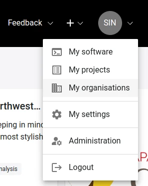
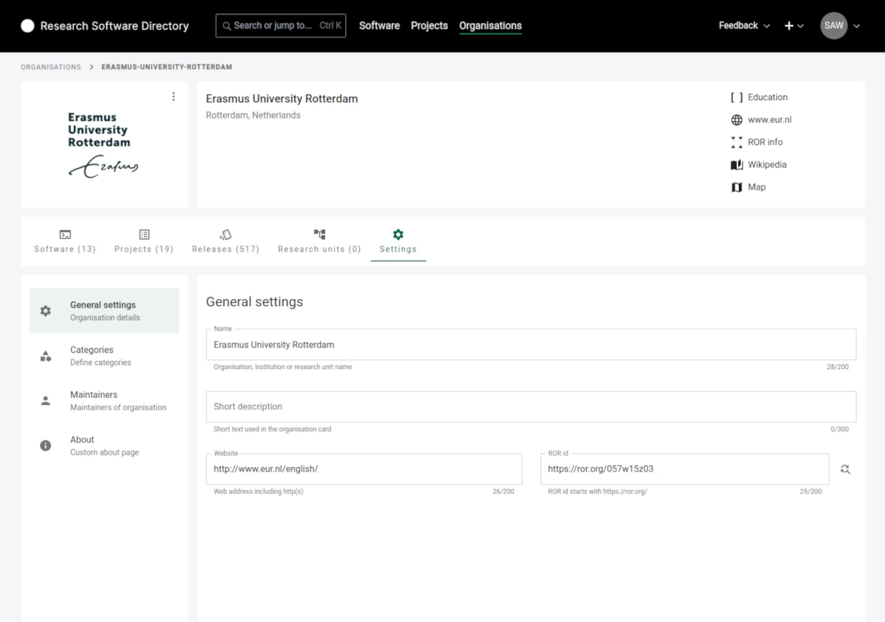

# Maintaining organisation

Organisations have the opportunity to maintain their representation within the RSD.
In order to achieve this, official representatives of the organisation can take on the role of maintainers of their organisation.

## How to claim an organisation

If you would like to claim an organisation, please have a look at [Register or claim an organization](/users/register-organisation/).

## What can organisation maintainers do

To edit your organisations, open the organisation either via the __Organisations list__, or your the __My organisations__ option in your __User profile__.

The RSD distinguishes between __primary__ and __invited maintainers__.
Here is an overview of what each of them can do:

|                                        | Primary maintainer | Invited maintainer |
|----------------------------------------|:------------------:|:------------------:|
| Edit About section                     |         x          |         x          |
| Upload/delete logo                     |         x          |         x          |
| Edit organisation metadata             |         x          |         x          |
| Reject affiliations (software/project) |         x          |         x          |
| Pin/unpin software/projects            |         x          |         x          |
| Add new research units                 |         x          |                    |
| Invite maintainers                     |         x          |         x          |
| Remove maintainers (not primary)       |         x          |         x          |
| Remove/change primary maintainer *     |                    |                    |
| Change organisation URL path *         |                    |                    |

(*) These actions can only be perfomred by administators. If necessary, contact us via [rsd@esciencecenter.nl](mailto:rsd@esciencecenter.nl).

### Edit logo

You can edit the logo of your organisation

You can upload a new logo or remove it.
The RSD supports common image formats, e.g. jpg, png or svg.

:::tip
If possible, please upload an __SVG__ version of your organisation's logo for optimal visual presentation within the RSD.
:::

### General settings

Under __"Settings"__ you can edit:

<table>
    <tr>
        <td>Name</td>
        <td>Will be displayed when your organisation is referenced</td>
    </tr>
    <tr>
        <td>ROR id</td>
        <td>Used to display metadata in the organsation's card (see <a href="#edit-logo">Edit logo</a>)</td>
    </tr>
    <tr>
        <td>Website</td>
        <td>Used in the organsation's card (see <a href="#edit-logo">Edit logo</a>)</td>
    </tr>
</table>

### Manage maintainers

As a maintainer, you can invite or remove other maintainers from your organisation.
A list of existing maintainers will be shown:

:::warning
The __primary maintainer__ of an organisation cannot be removed (in this example "Maintainer 1").
If you want to exchange the primary maintainer, contact us via [rsd@esciencecenter.nl](mailto:rsd@esciencecenter.nl).
:::

To invite new maintainers, click on __"Generate invite link"__. A link will be generated. You can either copy this link or click on "Email this invite" to open your mail program with a preformulated email.

### Edit About Section

In the __"About"__ section, relevant information about your organisation can be added in a free text form.
To edit the content of the section, please navigate to __"Settings"__ and scroll down to the __"About page"__ section (see [Manage metadata](#manage-metadata)).
The text can be formatted using the [Markdown syntax](https://www.markdownguide.org/basic-syntax/).

:::warning
If there is no content for Abou page, the page will not be shown.
:::

### Pin software or projects

To pin specific software or projects to the start of the respective list, click on the three dots in the upper right corner of a software or project card and click on __Pin software__ / __Pin project__. It will then be shown at the beginning of the list. If you no longer want to pin a software or project, click on the dots in the software card and click __Unpin software__ / __Unpin project__.

### Denying affiliations

An organisation maintainer can deny affiliations with software or projects.
To do this, open the context menu of the respective software or project, and click on __Block affiliation__.
The entry will now be marked with a red sign:

When the affiliation with an entry has been denied, the

* entry will not appear in the organisation lists
* the organisation will not appear on the entry's page
* the entry will not be included in metrics of the organisation

The denied affiliation will be visible to the organisation maintainer until the software/project maintainer removes the affiliation.

### Add research units

The RSD is capable of representing the organisational structure of an organisation.
The structure is represented using __Research units__. A research unit has the same properties as an organisation and is maintained in the same manner, except for the fact that it has a parent organisation and is not listed on the organisations overview grid.

It is possible to create several levels of nested research units.

:::warning
Research units can only be added by the __primary maintainer__.
:::

To create new research units, navigate to the __Research units__ in the sidebar, and click on the __+ Add__ button in the upper right corner. You will be presented with a modal:

The RSD path (second input field) will be automatically populated while the name is ist typed, but can be adjusted afterwards.

:::warning
You cannot edit the __RSD Path__ afterwards.
:::

If possible, a logo and a website URL can be added as well.
These information can also be added at a later stage.
