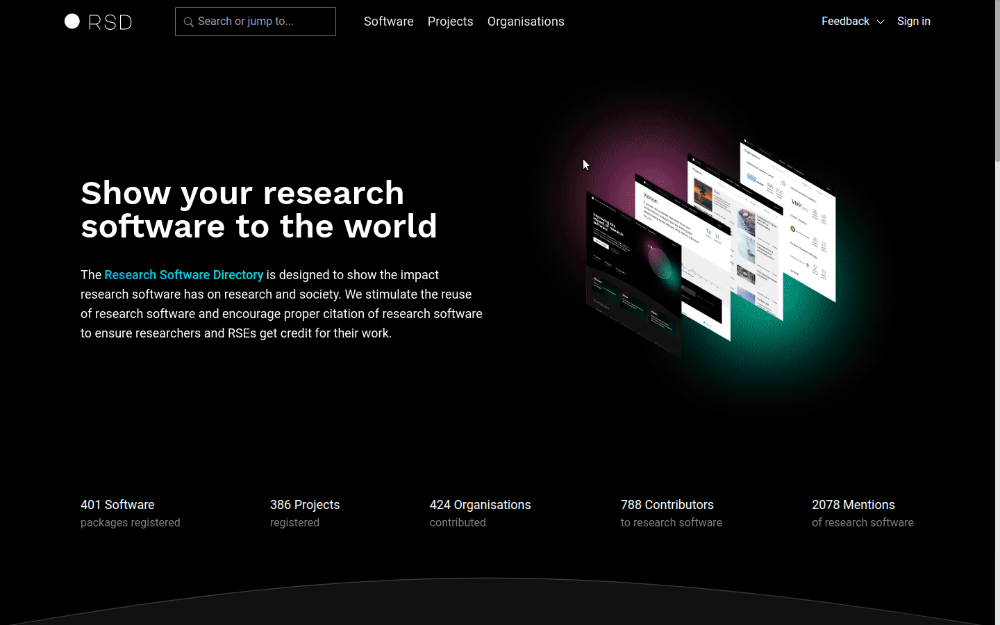

# Getting started

To run your own RSD instance you can use [deployment.zip file provided in the RSD release](https://github.com/research-software-directory/RSD-as-a-service/releases).

:::warning
To be able to use `deployment.zip` file, you need a machine with Docker and Docker compose. In production you also need a third party authentication service with one or more of the following providers: [Microsoft Entra ID (Azure AD)](/rsd-instance/configurations/#enable-microsoft-entra-id-azure-ad-authentication), [ORCID](/rsd-instance/configurations/#enable-orcid-authentication), [SURFconext](/rsd-instance/configurations/#enable-surfconext-authentication) or [Helmholtz AI](/rsd-instance/configurations/#enable-helmholtz-ai-authentication).
:::

- Unzip `deployment.zip` file. It contains:

  - `.env.example` is an environment example file
  - `CITATION.cff` contains citation information of RSD software.
  - `docker-compose.yml` defines all required RSD services and exposes environment variables used by each service
  - `nginx.conf` basic nginx configuration file.
  - `README.md` contains instructions

- Rename or copy `.env.example` to `.env` and provide the values in the SECRETS section of .env file. Please **do not use special characters** in the `.env` file. For the minimal local setup you should provide values for these variables

```env
POSTGRES_PASSWORD=reallyreallyreallyreallyverysafe
POSTGRES_AUTHENTICATOR_PASSWORD=reallyreallyreallyreallyverysafe
PGRST_JWT_SECRET=reallyreallyreallyreallyverysafe
```

- Start RSD using docker compose

```bash
docker compose up
```

- Visit http://localhost and confirm that the RSD is running

## Login using local account

To be able to login to RSD you need to enable at least one authentication provider. For testing purposes we offer the local account option. To enable it use `LOCAL` value in `RSD_AUTH_PROVIDERS` property in .env file.

```env
# consumed by services: frontend (api/fe)
# provide a list of supported OpenID auth providers
# the values should be separated by semicolon (;)
# if env value is not provided default provider is set to be SURFCONEXT
# if you add the value "LOCAL", then local accounts are enables, USE THIS FOR TESTING PURPOSES ONLY
RSD_AUTH_PROVIDERS=SURFCONEXT;ORCID;LOCAL
```

:::warning
When changing values of environment variables in .env file you need to restart RSD. Use `docker compose down` followed by `docker compose up -d`
:::

At this point you should be able to see RSD instance running. You should also be able to login using Local account by providing any username, for example `Tester`. In order to be able to make changes to RSD please accept the Terms of Service and the Privacy Statement after loging in.


:::danger
The local account login option is only for test purposes. Local accounts do not require a password and are therefore not safe.
:::

## Login as RSD adminstrator

To be able to login as rsd adminstrator you will need to provide the email address of the logged in user in the `RSD_ADMIN_EMAIL_LIST` property of the .env file. In the example below we defined one rsd admin having the email `isaacnewton@university-example.org`. This is the email of SURFconext test account with the username professor3 which has this email address provided in the JWT token that RSD receives from the SURFconext authentication provider.

```env
# Define a semicolon-separated list of user email addresses of RSD admins.
# When someome authenticates with an email address in this list,
# they will get a token with as role rsd_admin, meaning they
# have admin rights for all the tables.
# consumed by: authentication
RSD_ADMIN_EMAIL_LIST=isaacnewton@university-example.org
```

:::tip
- When you login to RSD as administrator you will see additional "Administration" option in the profile dropdown menu.
- To define admin email for LOCAL account use @example.org email domain. For example for user `Tester` the email should be `tester@example.org`
:::



## Customizing RSD instance

For customizing and administrating your RSD instance have a look at [configuration](/rsd-instance/configurations/) and [administration](/rsd-instance/administration/).
