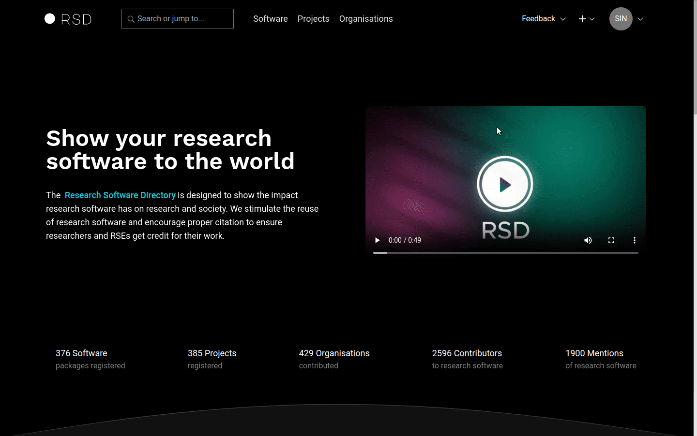
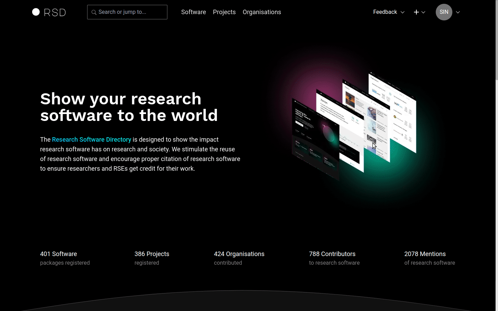
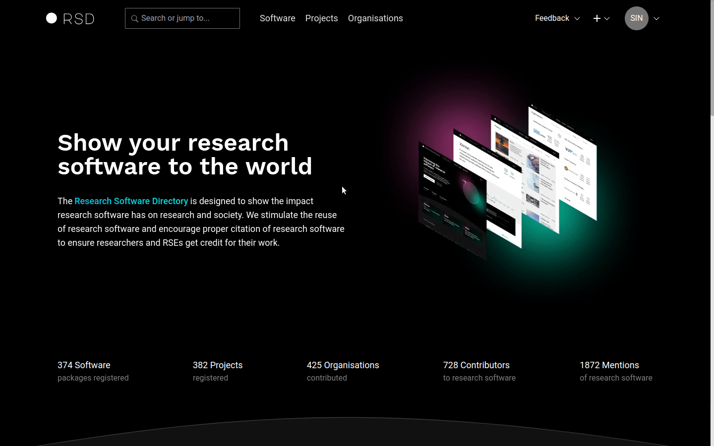

# Administration

This section describes administration options avilable in the RSD.

:::tip
To be able to login as RSD adminstrator you first need to define a list of rsd admin users in the .env file.
See [Login as rsd adminstrator in the getting started section](/rsd-instance/getting-started/#login-as-rsd-adminstrator).
:::

## Public pages

Here you can define custom public pages for you RSD instance. The links to custom public pages are shown in the footer of the RSD.

- The title is used as link label
- The slug is used as link
- The content of the page is in Markdown
- The page position can be changed using drag-drop handle (see animation below)

:::tip
You need to activate "Publish" switch and reload the page in order to see changes in the page footer.
:::

## Software highlights

The software overview page design has a highlights section. This section is **shown only when the software highlights are defined** by RSD admin.

:::tip
You can customise the software highlights section title in `settings.json` by providing a value for the optional property `software_highlights_title`.
:::

## ORCID users

This section shows the list of ORCIDs that are allowed to log in to the RSD. Because anyone can create an ORCID account, we decided to limit access only to ORCID users that are approved by an RSD administrator.

:::warning
In order to be able to log in with ORCID credentials, the [ORCID authentication provider needs to be enabled](/rsd-instance/configurations/#enable-orcid-authentication) and the ORCID of that user need to be added to this list.
:::

You can add, search and delete ORCIDs from the RSD. Use the bulk import button to add up to 50 ORCID users to the RSD at once.

## RSD users

This section shows all RSD users who logged in to RSD at least once. You can search for users, assign the adminstrator role (rsd_admin) or delete an user account.

:::danger

- Removing account will remove all its maintainer roles.
- You cannot delete account you are currently using.
:::

## RSD contributors

The page shows the list of all contributors and team members. You can search by name, email or ORCID. You can change the values in the table by clicking on the value. The values is automatically saved after you navigate out of the edit box. The link in the last column will open the software or project item where this contributor/team member is used.

## Organisations

This page allows management of all organisations added to RSD. RSD users can add new organisation on the software or project pages. We use ROR database to retreive additional information about the organisation.

### Add organisation

Use search box to find the organisation in the ROR database. This is preffered approach. If the organisation cannot be found in ROR database you will see "Add..." option and you will be able to add basic organisation information manually.

### Define organisation primary maintainer

The primary maintainer of an organisation is defined by rsd adminstrator. You need to provide user id in the generall settings section. The user id is unique and it is automatically created by RSD after an user is logged in for the first time.

:::tip
Only the organisation's primary maintainer or RSD administrator can create research units of an organisation.
:::

### Delete organisation

To delete organisation use delete button.

:::warning
You can delete organisation only if there are no software and project items assotiated with it.
:::

### Edit organisation

For editing the organisation see [maintaining the organisation section](/users/organisation/).

## Keywords

RSD comes with an predefined list of keywords. You can change the list by adding new keywords or deleting the existing entries.

:::warning
You can delete the keyword only when it is not used in any software or project.
:::

## Error logs

This section shows any errors originating from the background processes like data scrapers. Provided information should be understandable to rsd administrators in the most cases. The error object contains error response. The stacktrace is convinient for the programmers. The link will navigate you to the software or the project that triggers the error.

## Announcement

This section is used to show public announcements to all users of the RSD. It is generally ment to announce the RSD maintaince moment.

