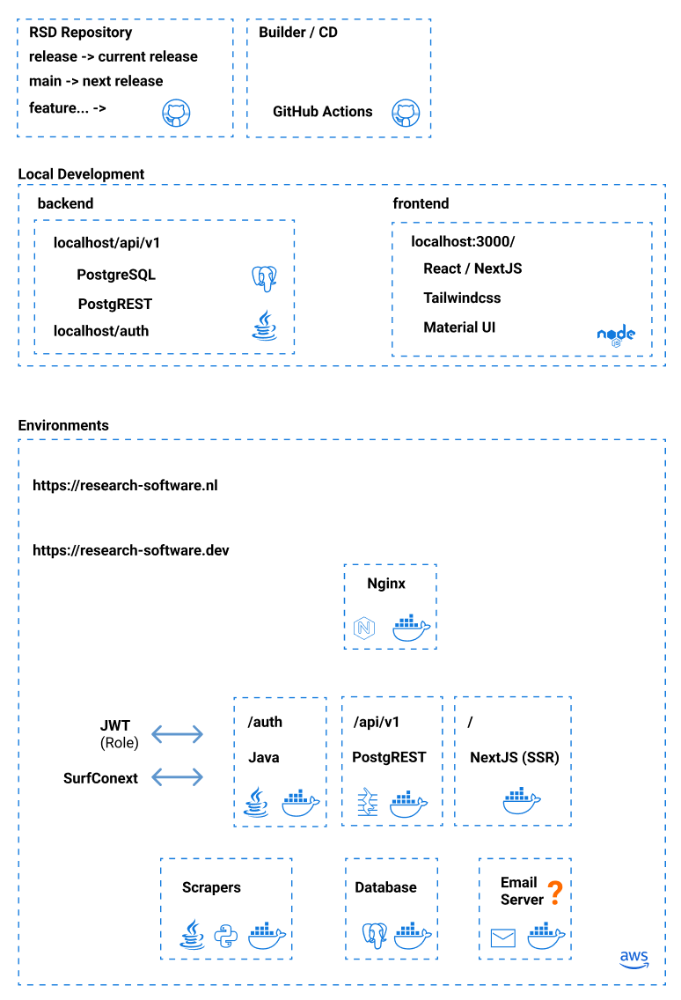

# Getting started

To run the application locally you need to install the following dependencies:

* [Docker](https://docs.docker.com/get-docker/) with docker compose
* [Node.js](https://nodejs.org/en) v20
* [`yarn`](https://yarnpkg.com) v1.22.x
* `make`
  * Available in most Linux distributions.
  * Often also in MacOS systems but, if not, you can get it by installing the command line tools with `xcode-select --install`.
  * For Windows, you can install it via [`chocolatey`](https://community.chocolatey.org/packages/make).

## RSD services

The RSD-as-a-Service repository is consist of different services stored in the separate folders:

* `authentication`: RSD authentication service (Java)
* `backend-postgrest`: postgREST api
* `data-generation`: data generation service is used during development to generate test data (Node.js)
* `data-migration`: used to migrate legacy RSD data from the previous version (Java)
* `database`: RSD database structure and functions (PostgreSQL)
* `deployment`: docker-compose.yml file and default RSD settings provided as an example of deployment
* `documentation`: RSD documentation for users, developers and contributors (Node/Docusaurus)
* `frontend`: RSD user interface/frontend (Node.js/React.js/Next.js)
* `nginx`: reverse proxy used to internally route requests to specific RSD service
* `scrapers`: various scraper services used by RSD to obtain or update additional metadata (Java/Python)

## Environment variables

The environment variables should be stored in a .env file, which is automatically loaded by docker compose. To validate loading of env variables use `docker compose config`. More info about the use of environment variables in docker compose is available at [official documentation](https://docs.docker.com/compose/environment-variables/)

* copy the file `.env.example` to `.env` file at the root of the project

```bash
# from project root dir
cp .env.example .env
```

* You need to modify the new .env file with the corresponding value secrets.
* build local images

```bash
# from project root dir
docker compose build
```

## Running locally

Run the command `docker compose up`.

```bash
# from project root dir
docker compose up
```

The application can be viewed at http://localhost

## Logging in with admin rights

The default role assigned to a logged in user is `rsd_user`. To obtain the `rsd_admin` role, you need to update the `RSD_ADMIN_EMAIL_LIST` variable in `.env`.

### Local accounts

:::danger
Local accounts should only be used in development mode.
:::

If you activated local login by adding `LOCAL` to `RSD_AUTH_PROVIDERS`, admin rights can be obtained by adding `<name>@example.com` to `RSD_ADMIN_EMAIL_LIST`, where `<names>` is the name entered when logging in. Here is an example:

```bash
RSD_AUTH_PROVIDERS=LOCAL
RSD_ADMIN_EMAIL_LIST=admin@example.com
```

If you now login as the user `admin`, you will be assigned the role `rsd_admin`.

### Other IDPs

If you are using other IDPs, make sure to add the mail address that is being provided by the IDP. If you are using the SURFconext development instance, have a look at [this list](https://idp.diy.surfconext.nl/showusers.php) to obtain the email addresses that are provided for the test accounts.

## Frontend with hot-module-replacement (HMR)

To run the frontend in the development mode with the hot-module-replacement (HMR) you should start an additional instance of the frontend which will be available at http://localhost:3000

```bash
# navigate to frontend folder
cd frontend
# install dependencies
yarn install
# start fe in dev mode
yarn dev
```

More information about the frontend setup is [available in the frontend readme file](https://github.com/research-software-directory/RSD-as-a-service/tree/main/frontend#readme).

## Documentation site

To run locally the documentation site, you need `Node.js` and npm installed on your machine.

```bash
# navigate to frontend folder
cd documentation
# install dependencies
npm install
# start fe in dev mode
npm start
```

More information about documentation setup is [available in the documentation readme file](https://github.com/research-software-directory/RSD-as-a-service/tree/main/documentation#readme).

## Clear/remove data (reset)

To clear the database, if the database structure has changed or you need to run data migration again, run the command:

```bash
docker compose down --volumes
```

## Tech Stack


